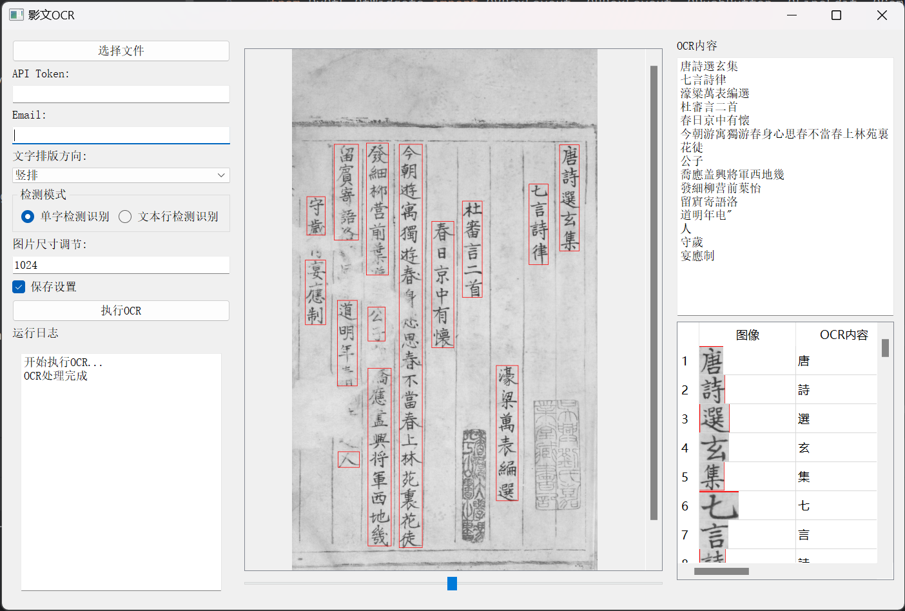

# 影文OCR

本项目是一个基于Python和PyQt5开发的古籍OCR程序。它利用了[看典古籍](https://kandianguji.com/)的API接口，专门针对古籍文献的字符识别和解析。

## 特点

- **优雅的界面**: 使用PyQt5开发，提供直观易用的图形用户界面。
- **高效古籍识别**: 利用看典古籍API，有效识别古籍中的文本。

## 安装

本程序要求在Python环境下运行。确保您的系统已安装Python和PyQt5。

1. 克隆仓库到本地：
   ```
   git clone
   ```
2. 安装所需的依赖：
   ```
   pip install -r requirements.txt
   ```

## 运行界面



## 致谢

特此感谢[看典古籍](https://kandianguji.com/)提供的API接口，使得本项目的实现成为可能。

## 许可

本项目采用。请参阅 `LICENSE` 文件获取更多信息。
